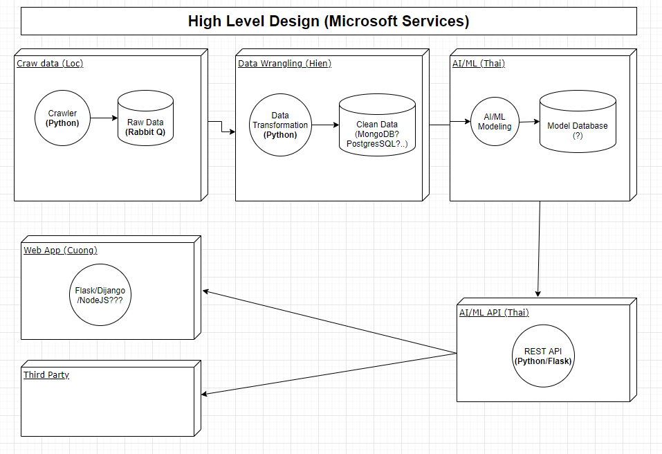

# Giới thiệu về TopDup 
TopDup là dự án cộng đồng được khởi xướng bởi [Forum Machine Learning Cơ bản](https://www.facebook.com/groups/machinelearningcoban) nhằm hỗ trợ các website, blog công nghệ bảo vệ bản quyền bài viết và chống sao chép.

Ý tưởng cơ bản cuả dự án là quét toàn bộ tin tức từ các website, blog công nghệ phổ biến tại Việt Nam, sử dụng NLP để xác định những bài viết giống nhau. Qua đó giúp chủ bài viết dễ dàng phát hiện nếu bài viết cuả mình bị sao chép trái phép. 

Dự án là một nỗ lực nhằm chống lại tình trạng vi phạm bản quyền bài viết phổ biến trong giới công nghệ Việt Nam. Xem thêm [Vụ việc Topdev sao chép nhiều bài viết từ Viblo mà không xin phép](https://www.facebook.com/groups/machinelearningcoban/permalink/1036374896819917)  

# Tiến độ và kết quả dự án   
Tính đến ngày 26/9/2020, dự án đã cơ bản hoàn thành bộ quét bài viết từ các trang công nghệ phổ biến tại Việt Nam trên cơ sở bộ quét [Đọc báo](https://github.com/hailoc12/docbao). Model phát hiện bài viết trùng lặp và frontend hiển thị dữ liệu cơ bản cũng đã được hoàn tất. 

Để đóng góp cho dự án, mời bạn tham khảo [CONTRIBUTING.md](../docs/CONTRIBUTING.md)  

# Cấu trúc dự án hiện tại 
Hiện tại TopDup được chia thành 5 modules chính để các team có thể phân chia phát triển song song với nhau 

# Cấu trúc thư mục 
~~~
/modules: chứa toàn bộ mã nguồn cuả dự án, được chia theo từng modules
    /crawlers: mã nguồn quét dữ liệu 
    /data_wranglers: mã nguồn xử lí và làm sạch dữ liệu 
    /ml: mã nguồn cho machine learning / AI 
    /ml_api: mã nguồn cho public contract của ML/AI
    /web_app: mã nguồn cho website TopDup
    /legacies: mã nguồn cho TopDup phiên bản cũ (sau này sẽ xoá khi phiên bản TopDup mới được release)
        /topdup_open: mã nguồn lọc bài viết trùng và frontend 
        /docbao: max nguồn quét dữ liệu
~~~
